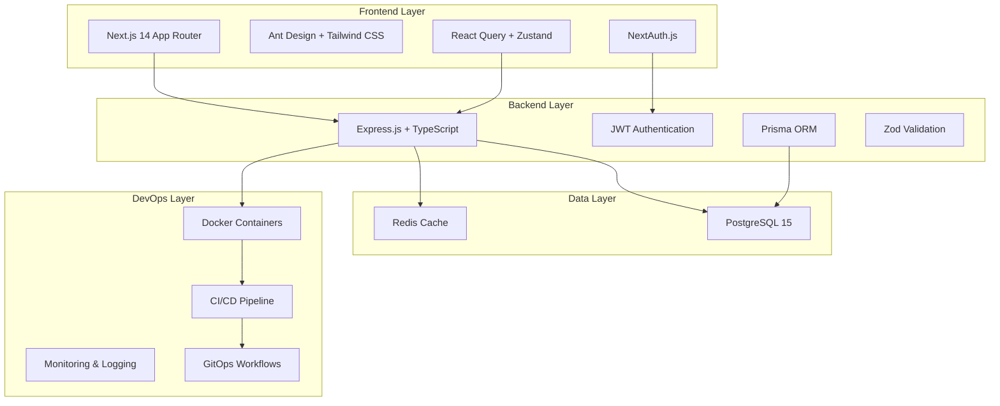

# Taskie Design Document

## Overview

Taskie is a modern, full-stack team task management application built with Next.js 14 and Express.js. The system follows a clean architecture pattern with clear separation between frontend, backend, and data layers. The application emphasizes modern DevOps practices, responsive design, and scalable architecture.

## Architecture

### High-Level Architecture



### Frontend Architecture

The frontend follows Next.js 14 App Router conventions with a component-based architecture:

- **App Router Structure**: Utilizes file-based routing with layout components
- **State Management**: React Query for server state, Zustand for client state
- **Component Library**: Ant Design components styled with Tailwind CSS
- **Authentication**: NextAuth.js integration with JWT backend
- **Testing**: Jest and React Testing Library for comprehensive testing

### Backend Architecture

The backend implements a layered architecture pattern:

- **API Layer**: Express.js routes with TypeScript
- **Service Layer**: Business logic and data processing
- **Repository Layer**: Data access through Prisma ORM
- **Authentication Layer**: JWT-based authentication with bcrypt
- **Validation Layer**: Zod schemas for request/response validation

## Components and Interfaces

### Frontend Components

#### Core Layout Components

- `RootLayout`: Main application layout with navigation
- `AuthLayout`: Authentication-specific layout
- `DashboardLayout`: Main dashboard layout with sidebar
- `ProjectLayout`: Project-specific layout with context

#### Feature Components

- `AuthComponents`: Login, Register, Profile forms
- `ProjectComponents`: ProjectList, ProjectCard, ProjectForm, MemberManagement
- `TaskComponents`: TaskList, TaskCard, TaskForm, TaskComments, TaskFilters
- `AnalyticsComponents`: Dashboard, Charts, Metrics
- `UserComponents`: UserProfile, UserList, UserSettings

#### Shared Components

- `Navigation`: Header, Sidebar, Breadcrumbs
- `UI`: Buttons, Forms, Modals, Loading states
- `Layout`: Grid, Cards, Containers

### Backend Interfaces

#### API Controllers

```typescript
interface AuthController {
  register(req: RegisterRequest): Promise<AuthResponse>;
  login(req: LoginRequest): Promise<AuthResponse>;
  logout(req: LogoutRequest): Promise<void>;
  getCurrentUser(req: AuthenticatedRequest): Promise<UserResponse>;
  refreshToken(req: RefreshRequest): Promise<TokenResponse>;
}

interface ProjectController {
  getProjects(req: PaginatedRequest): Promise<ProjectListResponse>;
  createProject(req: CreateProjectRequest): Promise<ProjectResponse>;
  getProject(req: GetProjectRequest): Promise<ProjectResponse>;
  updateProject(req: UpdateProjectRequest): Promise<ProjectResponse>;
  deleteProject(req: DeleteProjectRequest): Promise<void>;
  addMember(req: AddMemberRequest): Promise<void>;
  removeMember(req: RemoveMemberRequest): Promise<void>;
}

interface TaskController {
  getTasks(req: TaskFilterRequest): Promise<TaskListResponse>;
  createTask(req: CreateTaskRequest): Promise<TaskResponse>;
  getTask(req: GetTaskRequest): Promise<TaskResponse>;
  updateTask(req: UpdateTaskRequest): Promise<TaskResponse>;
  deleteTask(req: DeleteTaskRequest): Promise<void>;
  addComment(req: AddCommentRequest): Promise<CommentResponse>;
}
```

#### Service Interfaces

```typescript
interface AuthService {
  authenticateUser(credentials: LoginCredentials): Promise<User>;
  generateTokens(user: User): Promise<TokenPair>;
  validateToken(token: string): Promise<User>;
  hashPassword(password: string): Promise<string>;
}

interface ProjectService {
  createProject(data: CreateProjectData, userId: string): Promise<Project>;
  getUserProjects(userId: string, pagination: Pagination): Promise<ProjectList>;
  updateProject(
    projectId: string,
    data: UpdateProjectData,
    userId: string
  ): Promise<Project>;
  addProjectMember(
    projectId: string,
    userId: string,
    role: ProjectRole
  ): Promise<void>;
}
```

## Data Models

### Database Schema

```typescript
// User Model
interface User {
  id: string
  email: string
  username: string
  firstName: string
  lastName: string
  avatar?: string
  createdAt: Date
  updatedAt: Date
  projects: ProjectMember[]
  assignedTasks: Task[]
  comments: Comment[]
}

// Project Model
interface Project {
  id: string
  name: string
  description?: string
  color: string
  ownerId: string
  owner: User
  members: ProjectMember[]
  tasks: Task[]
  createdAt: Date
  updatedAt: Date
}

// ProjectMember Model
interface ProjectMember {
  id: string
  userId: string
  projectId: string
  role: ProjectRole
  user: User
  project: Project
  joinedAt: Date
}

// Task Model
interface Task {
  id: string
  title: string
  description?: string
  status: TaskStatus
  priority: TaskPriority
  assigneeId?: string
  projectId: string
  assignee?: User
  project: Project
  comments: Comment[]
  dueDate?: Date
  createdAt: Date
  updatedAt: Date
}

// Comment Model
interface Comment {
  id: string
  content: string
  taskId: string
  authorId: string
  task: Task
  author: User
  createdAt: Date
  updatedAt: Date
}

// Enums
enum TaskStatus {
  TODO = 'TODO'
  IN_PROGRESS = 'IN_PROGRESS'
  IN_REVIEW = 'IN_REVIEW'
  DONE = 'DONE'
}

enum TaskPriority {
  LOW = 'LOW'
  MEDIUM = 'MEDIUM'
  HIGH = 'HIGH'
  URGENT = 'URGENT'
}

enum ProjectRole {
  OWNER = 'OWNER'
  ADMIN = 'ADMIN'
  MEMBER = 'MEMBER'
  VIEWER = 'VIEWER'
}
```

### API Response Models

```typescript
interface AuthResponse {
  user: UserResponse;
  tokens: TokenPair;
}

interface UserResponse {
  id: string;
  email: string;
  username: string;
  firstName: string;
  lastName: string;
  avatar?: string;
}

interface ProjectResponse {
  id: string;
  name: string;
  description?: string;
  color: string;
  owner: UserResponse;
  members: ProjectMemberResponse[];
  taskCounts: TaskStatusCounts;
  createdAt: string;
  updatedAt: string;
}

interface TaskResponse {
  id: string;
  title: string;
  description?: string;
  status: TaskStatus;
  priority: TaskPriority;
  assignee?: UserResponse;
  project: ProjectSummary;
  comments: CommentResponse[];
  dueDate?: string;
  createdAt: string;
  updatedAt: string;
}
```

## Error Handling

### Frontend Error Handling

- **React Error Boundaries**: Catch and display component errors gracefully
- **API Error Handling**: Centralized error handling with React Query
- **Form Validation**: Real-time validation with clear error messages
- **Network Errors**: Retry mechanisms and offline state handling
- **Authentication Errors**: Automatic token refresh and redirect to login

### Backend Error Handling

- **Global Error Middleware**: Centralized error processing and logging
- **Validation Errors**: Structured error responses with field-specific messages
- **Authentication Errors**: Proper HTTP status codes and error messages
- **Database Errors**: Connection handling and transaction rollbacks
- **Rate Limiting**: API rate limiting with appropriate error responses

```typescript
interface ApiError {
  code: string;
  message: string;
  details?: Record<string, any>;
  timestamp: string;
  path: string;
}

interface ValidationError extends ApiError {
  fields: FieldError[];
}

interface FieldError {
  field: string;
  message: string;
  value?: any;
}
```

## Testing Strategy

### Frontend Testing

- **Unit Tests**: Component testing with React Testing Library
- **Integration Tests**: Feature testing with user interactions
- **E2E Tests**: Critical user flows with Playwright or Cypress
- **Visual Regression**: Component visual testing
- **Accessibility Tests**: WCAG compliance testing

### Backend Testing

- **Unit Tests**: Service and utility function testing
- **Integration Tests**: API endpoint testing with test database
- **Contract Tests**: API contract validation
- **Performance Tests**: Load testing for critical endpoints
- **Security Tests**: Authentication and authorization testing

### Test Structure

```
tests/
├── frontend/
│   ├── components/
│   ├── pages/
│   ├── hooks/
│   └── e2e/
├── backend/
│   ├── controllers/
│   ├── services/
│   ├── repositories/
│   └── integration/
└── shared/
    ├── fixtures/
    └── utilities/
```

## UI Design System

### Color Palette

- **Primary Blue**: #0D65F2 (buttons, links, active states)
- **Secondary Pink**: #FEE9F0 (backgrounds, highlights)
- **Accent Gold**: #DFB032 (warnings, important actions)
- **Supporting Colors**:
  - Success Green: #52C41A
  - Error Red: #FF4D4F
  - Warning Orange: #FA8C16
  - Neutral Gray: #8C8C8C
  - Background Gray: #F5F5F5
  - Text Dark: #262626
  - Text Light: #595959

### Typography

- **Primary Font**: Inter (system font fallback)
- **Headings**: Bold weights (600-700)
- **Body Text**: Regular weight (400)
- **Code**: Fira Code or Monaco

### Component Design Principles

- **Consistency**: Unified spacing, colors, and typography
- **Accessibility**: WCAG 2.1 AA compliance
- **Responsiveness**: Mobile-first design approach
- **Performance**: Optimized components and lazy loading
- **Usability**: Clear visual hierarchy and intuitive interactio
